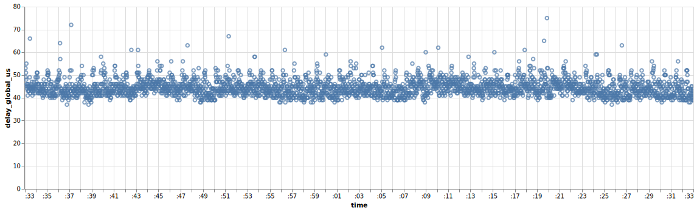

.. _Ipanalysis:

DelayMeas module Guide
=======================

Introduction
------------
The `delay_meas` module provides utilities to report the time took by every packet to traverse the CMX.

The `Polars <https://pola.rs>`_ library is used for efficient data manipulation and analysis.

This consist in two steps:

- Retrieving the central_service.log file containing the delay measurement results. This file is found on the CMX in the DATAUNIT/rohde-schwarz/log/DAU directory.
- Use a function in the 'delay_meas' utilities to get Polars Dataframes.

Get the Polars Dataframes
---------------------------------------
The following example shows the usage of the delay_meas module to get Polars Dataframes from the delay measurement results.

.. code-block:: python

    import rs_mrt_dau_utilities.delay_meas as delay

    measurements = delay.extract_delay_from_log(
        "central_service.log"
    )

    # get the first measurement dataframe of the first measurement cycle
    first_meas = measurements["1_1"]
    print(first_meas)

    #shape: (3_003, 5)
    # ┌──────────────────┬─────────────────┐
    # │ hash             ┆ delay_global_us │
    # │ ---              ┆ ---             │
    # │ u64              ┆ i64             │
    # ╞══════════════════╪═════════════════╡
    # │ 1250852322484709 ┆ 53              │
    # │                  ┆                 │
    # │                  ┆                 │
    # │ 1251539517252070 ┆ 49              │
    # │                  ┆                 │
    # │                  ┆                 │
    # │ 1252226712019431 ┆ 51              │
    # │                  ┆                 │
    # │                  ┆                 │
    # │ 1252913906786792 ┆ 48              │
    # │                  ┆                 │
    # │                  ┆                 │
    # │ 1253601101554153 ┆ 55              │
    # │                  ┆                 │
    # │                  ┆                 │
    # │ …                ┆ …               │
    # │ 3311062235032987 ┆ 43              │
    # │                  ┆                 │
    # │                  ┆                 │
    # │ 3311749429800348 ┆ 39              │
    # │                  ┆                 │
    # │                  ┆                 │
    # │ 3312436624567709 ┆ 41              │
    # │                  ┆                 │
    # │                  ┆                 │
    # │ 3313123819335070 ┆ 39              │
    # │                  ┆                 │
    # │                  ┆                 │
    # │ 3313811014102431 ┆ 41              │
    # │                  ┆                 │
    # │                  ┆                 │
    # └──────────────────┴─────────────────┘

The measurements variable is a dictionary containing Polars dataframes. Each key in the dictionary is a combination of two numbers:

- The first number is a measurement cycle aka one start/stop. If multiple measurements were done, this number increments for each measurement.
- The second number is the measurement(s) activated during this cycle.

Every packet is represented by its hash value and the delay in microseconds it took to traverse the CMX.

This is possible to perform further analysis on these dataframes using Polars functionalities.
A plot of the delay distribution can be created as shown below (Altair library is used for plotting):

.. code-block:: python

    import rs_mrt_dau_utilities.delay_meas as delay
    
    delay.plot_all(first_meas)

.. toctree::
   :maxdepth: 2
